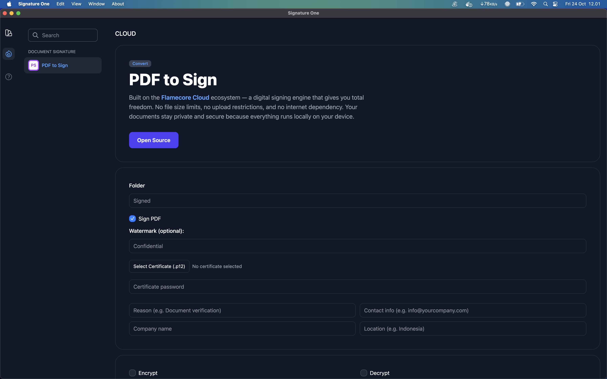

# Signature One

A desktop application for securely signing, encrypting, and managing the expiration of PDF documents.
Built with **Electron + React + Node.js**.

## Application Preview



---

## Downloads

| Platform | File                                                                                | Status |
| -------- | ----------------------------------------------------------------------------------- | ------ |
| Windows  | [Signature-One-Setup.exe](https://github.com/flamecorecloud/signature-one/releases) | ✅      |
| macOS    | [Signature-One.dmg](https://github.com/flamecorecloud/signature-one/releases)       | ✅      |
| Linux    | [Signature-One.AppImage](https://github.com/flamecorecloud/signature-one/releases)  | ✅   |

---

## Key Features

* Sign PDF files with a `.p12` certificate — fully offline
* **Batch Sign** — sign multiple documents at once
* **Batch Encrypt & Decrypt** PDF documents
* Works entirely offline — ensuring maximum privacy
* Available for Windows, macOS, and Linux

---

## Installation

1. Clone the repository:

   ```bash
   git clone https://github.com/flamecorecloud/signature-one.git
   cd signature-one
   ```
2. Install dependencies:

   ```bash
   npm install
   ```
3. Run the app in development mode:

   ```bash
   npm start
   ```
4. Build the application:

   ```bash
   npm run package
   ```

---

## Contact

Developed by [Andika Chamberlin](https://andikachamberlin.com)
Website: [https://flamecore.cloud](https://flamecore.cloud)
Tutorial: [YouTube](https://www.youtube.com/watch?v=qrnuoWDYUIg)
